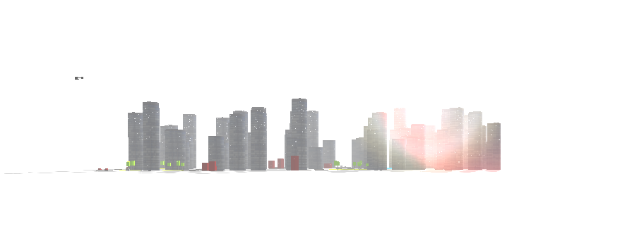

The brief was one word: **Squares**.

Wingify, the software company behind VWO, an A/B testing and experimentation platform, was sponsoring JSFoo 2014 and running a JavaScript competition alongside its Delhi event. The rules asked for something visually compelling made with JavaScript, HTML5 canvas, and squares. Visual appeal came first; code quality and smoothness came next.

I could have drawn a grid. Instead, I treated the square as a piece of world-building grammar.

## From shape to city

A square can be a road tile, a window, a building footprint, a pool, a garden, a shop, a car, or the face of a larger volume. Once I saw that, the idea stopped being “make an animation about squares” and became “build a small city whose entire vocabulary comes from squares.”

The world begins as a compact two-dimensional level map. Each value identifies a type of tile: building, road orientation, garden, pool, shop, or empty ground.

```js
var levelMap = [
  [F, A, A, A, J, A, A, C, 0],
  [B, 1, 1, 1, B, 1, 1, B, 0],
  [B, 3, 2, 1, G, 1, 4, G, 0]
];
```

That little matrix was the city plan. The Babylon.js scene synthesizer walked it and turned each symbol into geometry. Buildings received randomized heights and occasional neighboring towers. Road codes selected matching textures and rotations. Gardens scattered low-poly trees. Pools, shops, and open areas broke the rhythm of the skyline.

The result changed on every load without losing its identity.

## Geometry before assets

I wanted the city to feel designed, but I did not want to depend on a traditional 3D asset pipeline. Most of the scene was assembled directly in code from boxes, planes, and four-sided cylinders.

The towers are a good example. A four-sided Babylon.js cylinder becomes a square building volume. Submeshes split its faces so the roof, base, and facade can carry different materials. The facade texture itself is generated on a temporary canvas: rows of grayscale pixels become a field of lit and unlit windows.

Cars were merged from two boxes. The helicopter combined a body, tail, and flat rotor. Roads were planes. Trees were narrow trunks and stretched blocks. The theme was not decoration applied after the fact; it determined the construction technique.

## A world needs motion

A procedurally generated city can still feel like a model on a table. The second half of the work was giving it a pulse.

Twenty simple cars are created up front and dispatched along chained tween paths. They turn at intersections and loop through the road network. A helicopter follows its own longer flight script above the blocks. Babylon.js handles the scene, shadows, fog, and camera, while Tween.js handles the movement choreography.

The atmosphere came from a deliberately exaggerated stack:

- a hemispheric light and a directional light with a 1024-pixel shadow map;
- exponential white fog to dissolve the far edge of the city;
- a 10,000-particle snow system emitting thousands of flakes per second;
- a hidden “sun” mesh driving a lens flare;
- ambient audio with visible volume controls;
- a scripted camera moving through fourteen positions and rotations before rising above the entire map.



That camera was essential. It turned a technical demo into a short journey. A wide shot established the skyline, low passes revealed streets and gardens, and the final overhead view returned everything to the original premise: a world organized as squares.

## Keeping the browser moving

This was 2014-era browser 3D, so smoothness could not be assumed. The demo preloaded textures before constructing the world, merged small meshes where it made sense, reused vehicles instead of constantly creating them, and kept the material language intentionally simple.

I also wrote a small scripted-camera layer rather than scattering animation callbacks throughout the scene. Each instruction could provide a position, rotation, speed, or callback. The layer advanced only when the current animation finished, which kept the visual sequence readable and the scene code manageable.

```js
ScriptCamera.runScript([
  { position: new BABYLON.Vector3(0, 10, -30), speed: 0.2 },
  { position: new BABYLON.Vector3(8, 2, 50), rotation: turnBack, speed: 0.2 },
  { position: new BABYLON.Vector3(0, 140, 0), rotation: topDown }
]);
```

## September 23

Wingify published the competition on August 25, set a September 20 deadline, and updated the post with the results on September 23. **Square City received first prize.**

The prize mattered, but the durable part was the lesson: a narrow constraint can produce a richer system than an open brief. “Squares” gave me a material, a map, an optimization strategy, and a visual language at the same time.

Years later, the implementation is visibly of its era. I would organize parts of it differently now. I would not change the instinct behind it: take the smallest unit in the brief, find the world hidden inside it, and make the camera prove that world exists.

## Archive links

- [Run the preserved demo](../../projects/squares/index.htm)
- [View the SquareCity repository](https://github.com/amansx/SquareCity)
- [Read Wingify's original JSFoo announcement and results](https://engineering.wingify.com/posts/jsfoo-run-up-event/)
